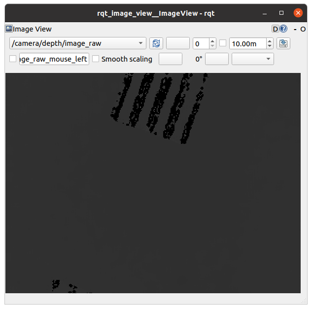
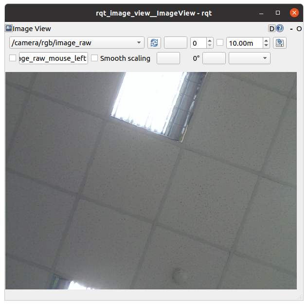
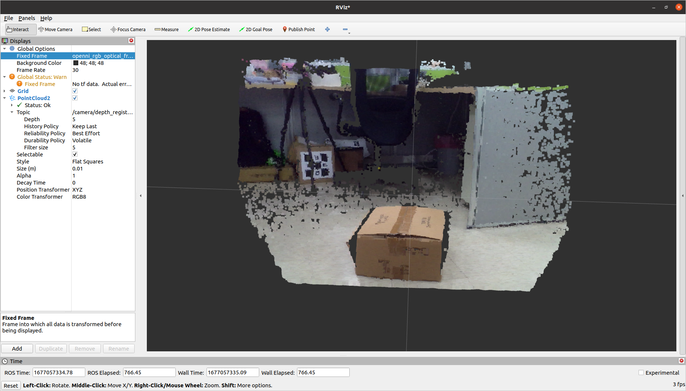

# ROS2 wrapper for OpenNI2 using LIPSedge 3D camera

## Introduction
Please read original [README](README-from-ROS.md) from ROS.

- ROS1:
Please check our repository [LIPSedge-ros](https://github.com/lips-hci/LIPSedge-ros) for installation guide.

- ROS2: ros2 branch supports Humble and later. We have tested LIPSedge cameras on Humble.

If you have any request or need any support, welcome to mail LIPS or submit your request here.

## Installation

 * Install openni2 package for Ubuntu
 ```
 $ sudo apt-get install libopenni2-0 libopenni2-dev
 ```
 
 * Download latest [LIPSedge SDK](https://www.lips-hci.com/lipssdk) and install it

For example, you get LIPSedge DL SDK and install it. 
```
$ tar -xzf LIPS-Linux-x64-OpenNI2.2.tar.gz
$ cd LIPS-Linux-x64-OpenNI2.2
$ sudo ./install.sh
```
## Build and launch this ROS2 Driver

Clone this repository and build it in ROS2 environment

```
$ mkdir -p ~/LIPSedge_ws/src
$ cd ~/LIPSedge_ws/src
$ git clone https://github.com/lips-hci/LIPSedge-ros2
$ colcon build
```

Launch camera service, use:

```
$ ros2 launch openni2_camera camera_only.launch.py
```

View depth/color/IR image by rqt, use:

```
$ rqt_image_view
```

Select topic */camera/depth/image_raw* in rqt:



Select topic */camera/rgb/image_raw* in rqt:



## Visualize PointCloud2 data

If you want to get a PointCloud2, launch camera with another script:

```
ros2 launch openni2_camera camera_with_cloud.launch.py
```

* Run Rviz tool in ROS2. In the left panel, manually type 'openni_rgb_optical_frame' to the field **Global Options -> Fixed Frame**.
* Add **PointCloud2** and change the field **Topic -> Reliablity Policy** to 'Best Effort'.

In the right panel, you should see visualized point cloud data.


