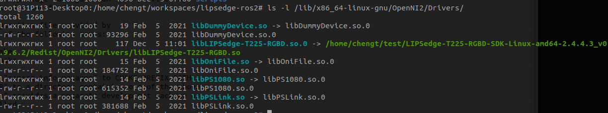
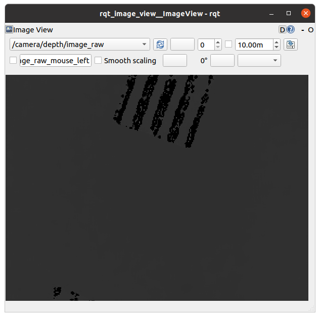
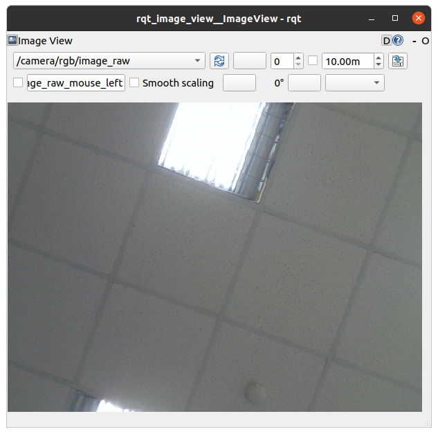
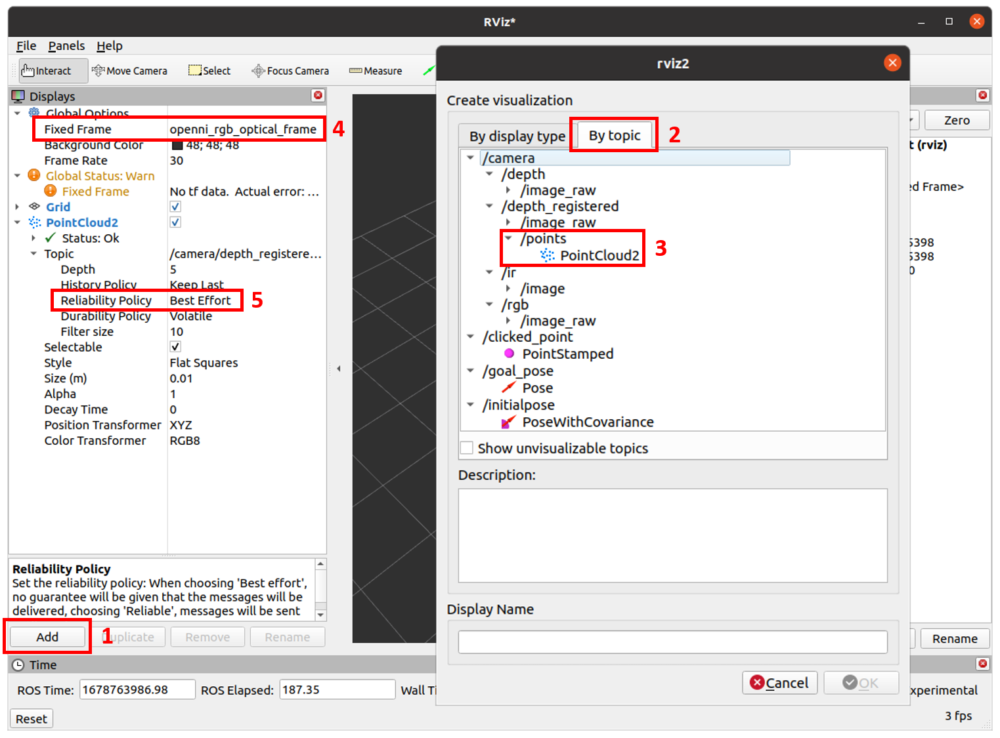
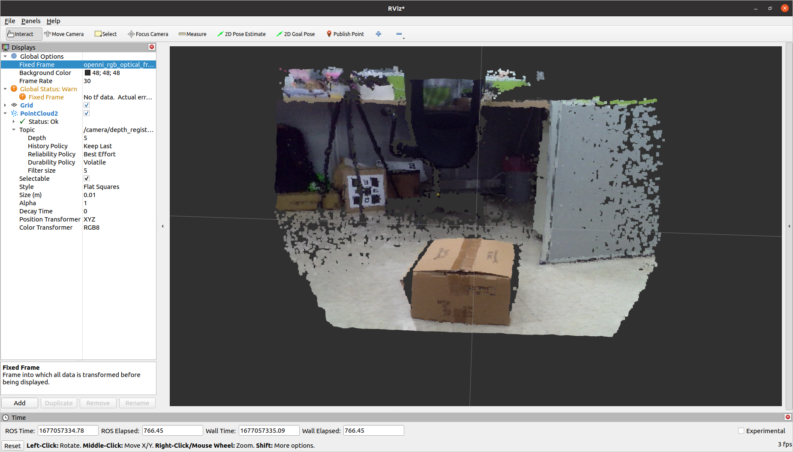

# ROS2 wrapper for OpenNI2 using LIPSedge™ camera

1. [Introduction](#introduction)
2. [Installation](#installation)
3. [Build and launch](#build-wrapper-and-launch-openni2_camera)
4. [Visualize PointCloud2](#visualize-pointcloud2-data)
5. [Troubleshooting](Troubleshooting.md)

## Introduction
Please read original [README](README-iron.md) from repo [ros-driver](https://github.com/ros-drivers/openni2_camera).

- ROS1:
Please check our repository [LIPSedge-ros](https://github.com/lips-hci/LIPSedge-ros) for installation guide.

- ROS2: ros2 branch supports Humble to Iron, but we only tested LIPSedge™ cameras on Humble.

If you have any request or need any support, welcome to mail LIPS or submit your request here.

## Installation

#### dependent packages

 * Install openni2 package for Ubuntu
 ```
 $ sudo apt-get install libopenni2-0 libopenni2-dev
 ```
 
#### LIPSedge™ camera SDK

LIPSedge™ camera is OpenNI2 compliant and supports ROS2 platform.

Get [LIPSedge™ SDK](https://www.lips-hci.com/lipssdk) for your camera and install it.

- For LIPSedge™ camera T235

Assume you got latest LIPSedge™ T235 SDK and install it.
```
$ chmod +x LIPSedge-T225-RGBD-SDK-Linux-amd64-2.4.4.3_v0.9.6.2.xz.run
$ ./LIPSedge-T225-RGBD-SDK-Linux-amd64-2.4.4.3_v0.9.6.2.xz.run
```
Follow steps on screen to finish installation or run below command to install SDK again.
```
$ cd LIPSedge-T225-RGBD-SDK-Linux-amd64-2.4.4.3_v0.9.6.2
$ sudo ./install.sh
```

- For LIPSedge™ camera DL/M3/AE4xx/L210

Assume you got LIPSedge™ DL SDK and install it.

```
$ tar -xzf LIPS-Linux-x64-OpenNI2.2.tar.gz
$ cd LIPS-Linux-x64-OpenNI2.2
$ sudo ./install.sh
```

## Build wrapper and launch openni2_camera

Clone this repository and build it in ROS2 environment

```
$ mkdir -p ~/LIPSedge_ws/src
$ cd ~/LIPSedge_ws/src
$ git clone https://github.com/lips-hci/LIPSedge-ros2
$ cd ~/LIPSedge_ws
$ colcon build

Starting >>> openni2_camera
Finished <<< openni2_camera [9.69s]                     

Summary: 1 package finished [9.84s]
```

#### For LIPSedge™ T235

You have to deploy LIPSedge™ camera driver to system before running launch script.

```
$ cd LIPSedge-T225-RGBD-SDK-Linux-amd64-2.4.4.3_v0.9.6.2
$ source OpenNIDevEnvironment
```

Go back to ros workspace source and run helper script.
```
$ cd ~/LIPSedge_ws/src
$ ./scripts/install_ros_T235_ubuntu22_x64.sh
SDK path found: /home/chengt/test/LIPSedge-T225-RGBD-SDK-Linux-amd64-2.4.4.3_v0.9.6.2/Redist
Creating lib,calib,OpenNI2 links in /lib/x86_64-linux-gnu
Finished.
```

Make sure LIPSedge™ T235 driver library has been installed to OpenNI2 Drivers repo in the system, you can see virtual link created for LIPSedge™ camera driver lib.
```
# ls -l /lib/x86_64-linux-gnu/OpenNI2/Drivers/
```


## Launch openni2_camera service
```
$ source ./install/setup.bash
$ ros2 launch openni2_camera camera_only.launch.py
```

View depth/color/IR image by rqt, use:

```
$ ros2 run rqt_image_view rqt_image_view
```

Select topic */camera/depth/image_raw* in rqt:



Select topic */camera/rgb/image_raw* in rqt:



## Visualize PointCloud2 data

If you want to get a PointCloud2, launch camera with another script:

```
$ source ./install/setup.bash
$ ros2 launch openni2_camera camera_with_cloud.launch.py
```

* Run Rviz tool in ROS2.
* Add **PointCloud2** and change the field **Topic -> Reliablity Policy** to '*Best Effort*'.
* In the left panel, manually change the field **Global Options -> Fixed Frame** to '*openni_rgb_optical_frame*'.



In the right panel, you should see visualized point cloud data.


