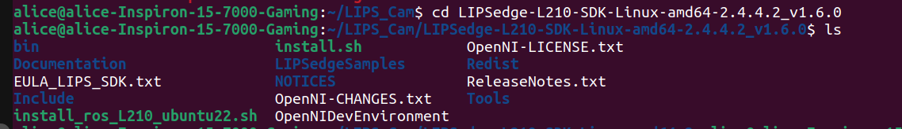

* [Error message: "No matching devices have been found"](Troubleshooting.md#no-matching-devices-have-been-found)
* [CMake Error (find_package): Could not find a package configuration file provided by "camera_info_manager"](Troubleshooting.md#cmake-error-could-not-find-package-camera_info_manager)
-----
### No matching devices have been found

- If you launch and see such error message, please try below steps.

  - Download helper scripts from folder [scripts](https://github.com/lips-hci/LIPSedge-ros2/tree/ros2/scripts)
  - Place install script inside your camera LIPSedge SDK and run it.

The script file name looks as *install_ros_{camera}_{os version}.sh*, select your camera model and OS version.

Below screenshot we use LIPSedge L210 camera as example, assume OS is Ubuntu 22.04.



```
$ sudo ./install_ros_L210_ubuntu22.sh
```
### CMake Error Could not find package camera_info_manager
When you run `colcon build` and see such CMake error
```
$ colcon build
Starting >>> openni2_camera
--- stderr: openni2_camera                         
CMake Error at CMakeLists.txt:10 (find_package):
  By not providing "Findcamera_info_manager.cmake" in CMAKE_MODULE_PATH this
  project has asked CMake to find a package configuration file provided by
  "camera_info_manager", but CMake did not find one.

  Could not find a package configuration file provided by
  "camera_info_manager" with any of the following names:

    camera_info_managerConfig.cmake
    camera_info_manager-config.cmake

  Add the installation prefix of "camera_info_manager" to CMAKE_PREFIX_PATH
  or set "camera_info_manager_DIR" to a directory containing one of the above
  files.  If "camera_info_manager" provides a separate development package or
  SDK, be sure it has been installed.
---
Failed   <<< openni2_camera [0.62s, exited with code 1]
```

You can install missing packages to solve it.
```
$ apt install ros-humble-camera-info-manager* -y
```
